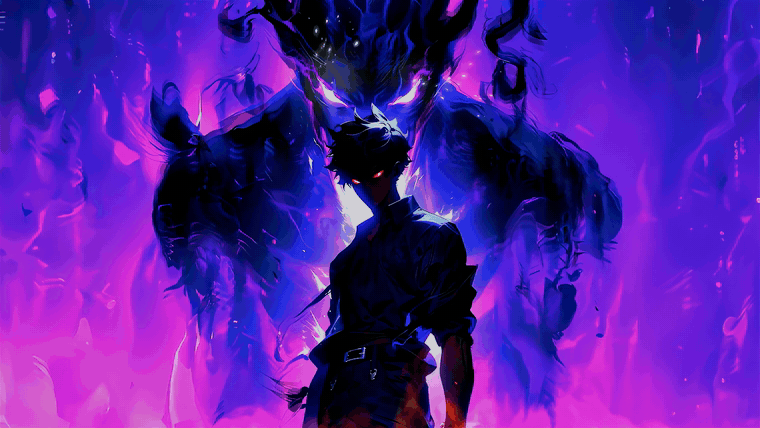
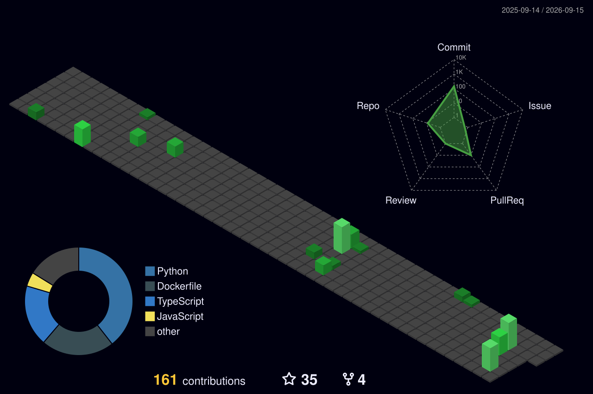

<!-- BANNER: your video, converted to an optimized GIF, committed as banner.gif -->

  

  

<h3 align="center">
  
</h3>

  
  

  
  

---

<table>
<tr>
<td valign="top"></td>
<td valign="top"></td>
</tr>
</table>

---

<h3 align="center">Work</h3>

  
  

  

---

<h3 align="center">Contributions</h3>

  

